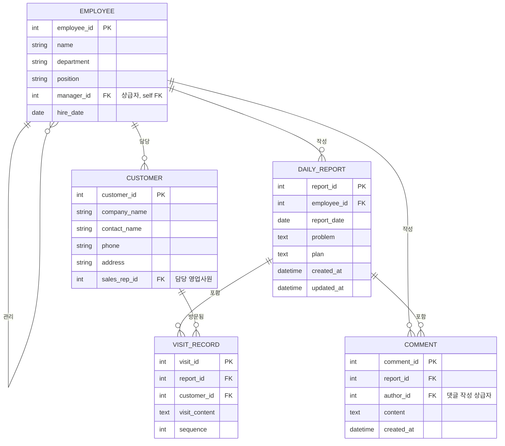

# 영업 일일 보고 시스템 요구사항 정의

## 1. 시스템 개요

영업 사원이 하루 동안의 고객 방문 활동을 보고하고, 현재 과제/상담 사항(Problem)과 다음 할 일(Plan)을 작성하면, 상급자가 이에 대해 댓글로 의견을 남길 수 있는 시스템.

## 2. 액터(Actor)

| 액터 | 역할 |
|---|---|
| 영업 사원 | 일일 보고 작성, 방문 내역 등록, Problem/Plan 작성 |
| 상급자 | 하급 영업 사원의 일일 보고 조회, 댓글(피드백) 작성 |
| 관리자 (선택) | 고객 마스터 / 영업사원 마스터 관리 |

## 3. 기능 요구사항

### 3.1 고객 마스터 관리
- 고객 정보(회사명, 담당자명, 연락처, 주소 등)를 등록/수정/조회한다.
- 고객마다 담당 영업사원을 지정할 수 있다.

### 3.2 영업사원 마스터 관리
- 영업사원 정보(이름, 부서, 직급, 입사일 등)를 등록/수정/조회한다.
- 조직 계층 구조 파악을 위해 상급자(관리자)를 지정한다.

### 3.3 일일 보고 작성
- 영업사원은 하루에 하나의 일일 보고를 작성한다 (영업사원 + 보고일자 단위로 유일).
- 일일 보고는 다음 항목으로 구성된다.
  - 방문 내역 목록 (고객 + 방문 내용) — 하루에 여러 건 등록 가능
  - Problem: 현재 과제/상담 사항
  - Plan: 내일 할 일

### 3.4 방문 내역 등록
- 하나의 일일 보고에 여러 건의 방문 내역(고객, 방문 내용)을 추가할 수 있다.
- 각 방문 내역은 고객 마스터의 특정 고객 1건과 연결된다.

### 3.5 댓글(피드백)
- 상급자는 부하 영업사원의 일일 보고(Problem/Plan)에 댓글을 남길 수 있다.
- 하나의 일일 보고에 여러 댓글이 달릴 수 있다 (상급자가 여러 차례 코멘트 가능).

## 4. 비기능 요구사항 (참고)

- 일일 보고는 날짜별 / 영업사원별 / 고객별로 조회할 수 있어야 한다.
- 상급자는 본인의 하급자가 작성한 보고에만 댓글을 남길 수 있어야 한다 (권한 제어).

## 5. ER 다이어그램

### 설계 노트

- `DAILY_REPORT`는 `(employee_id, report_date)` 조합에 유니크 제약을 두어 하루 1건만 작성되도록 한다.
- 방문 내역(`VISIT_RECORD`)은 하루에 여러 행이 필요하다는 요구사항에 따라 `DAILY_REPORT`의 하위 테이블로 분리했다.
- Problem/Plan은 요구사항상 방문 내역처럼 여러 행이 필요하다는 언급이 없어 `DAILY_REPORT`의 컬럼으로 두었다. 추후 각각 여러 건 작성이 필요해지면 별도 테이블로 분리 가능하다.
- `COMMENT`는 보고서(Problem/Plan) 단위로 달리며, 작성자(`author_id`)는 `EMPLOYEE`를 참조한다.
- `EMPLOYEE.manager_id`는 자기 자신을 참조하는 self-FK로 조직 계층(상급자-하급자) 관계를 표현한다.
