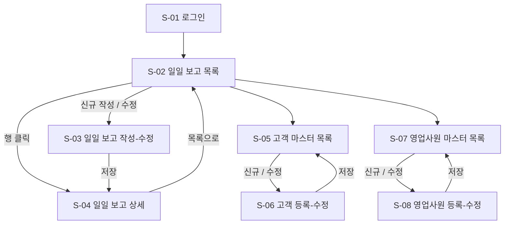

# 영업 일일 보고 시스템 화면 정의서

`requirements.md`의 요구사항 및 ER 다이어그램을 기준으로 작성한 화면 정의서.

## 1. 화면 목록

| 화면 ID | 화면명 | 접근 권한 | 설명 |
|---|---|---|---|
| S-01 | 로그인 | 전체 | 사번/비밀번호로 로그인 |
| S-02 | 일일 보고 목록 | 영업사원, 상급자 | 영업사원: 본인 보고 목록 / 상급자: 하급자 보고 목록 조회 |
| S-03 | 일일 보고 작성/수정 | 영업사원 | 방문 내역, Problem, Plan 작성 |
| S-04 | 일일 보고 상세 | 영업사원, 상급자 | 보고 내용 조회 + 댓글 작성/조회 |
| S-05 | 고객 마스터 목록 | 전체(관리자 편집) | 고객 목록 조회/검색 |
| S-06 | 고객 등록/수정 | 관리자 | 고객 정보 등록/수정 |
| S-07 | 영업사원 마스터 목록 | 관리자 | 영업사원 목록 조회/검색 |
| S-08 | 영업사원 등록/수정 | 관리자 | 영업사원 정보 등록/수정, 상급자 지정 |

## 2. 화면 흐름도

## 3. 화면 상세 정의

### S-01. 로그인

- **목적**: 사번/비밀번호 인증 후 시스템 진입
- **구성 요소**

| 항목 | 타입 | 설명 |
|---|---|---|
| 사번(employee_id) | 텍스트 입력 | 필수 |
| 비밀번호 | 패스워드 입력 | 필수 |
| 로그인 버튼 | 버튼 | 인증 성공 시 S-02 이동 |

- **비고**: 로그인한 사원의 `position`/`manager_id` 정보로 상급자 여부(팀원 보고 조회 가능 여부) 판단

---

### S-02. 일일 보고 목록

- **목적**: 본인(영업사원) 또는 팀원(상급자)의 일일 보고 이력을 조회
- **구성 요소**

| 항목 | 타입 | 설명 |
|---|---|---|
| 조회 기간 | 날짜 범위 선택 | 기본값: 최근 1주일 |
| 영업사원 선택 | 드롭다운 | 상급자 로그인 시에만 노출 (본인 + 하급자 목록) |
| 목록 테이블 | 테이블 | 컬럼: 보고일자, 영업사원명, 방문건수, 댓글수, 작성상태 |
| [신규 작성] 버튼 | 버튼 | 영업사원 본인만 노출, S-03 이동 |
| 행 클릭 | 이벤트 | S-04(상세) 이동 |

- **연관 테이블**: `DAILY_REPORT`, `EMPLOYEE`, `VISIT_RECORD`(건수 집계), `COMMENT`(건수 집계)

---

### S-03. 일일 보고 작성/수정

- **목적**: 당일 방문 내역, Problem, Plan을 작성/수정
- **구성 요소**

| 영역 | 항목 | 타입 | 설명 |
|---|---|---|---|
| 상단 | 보고일자 | 날짜 선택 | 기본값: 오늘, 사원+날짜 유니크 검증 |
| 방문 내역 (반복 영역) | 고객 선택 | 검색형 드롭다운 | 고객 마스터에서 검색/선택 |
| | 방문 내용 | 텍스트 영역 | 필수 |
| | [행 추가] 버튼 | 버튼 | 방문 내역 행을 추가 (여러 건 등록) |
| | [행 삭제] 버튼 | 버튼 | 해당 방문 내역 행 삭제 |
| Problem 영역 | Problem 내용 | 텍스트 영역 | 현재 과제/상담 사항 |
| Plan 영역 | Plan 내용 | 텍스트 영역 | 내일 할 일 |
| 하단 | [저장] 버튼 | 버튼 | 저장 후 S-04 이동 |
| | [취소] 버튼 | 버튼 | S-02로 이동 (미저장) |

- **검증 규칙**
  - 방문 내역은 최소 1건 이상 등록
  - 동일 사원 + 동일 보고일자 중복 작성 불가 (기존 보고 존재 시 수정 모드로 전환)

---

### S-04. 일일 보고 상세

- **목적**: 작성된 보고 내용 확인 및 상급자 댓글 작성
- **구성 요소**

| 영역 | 항목 | 타입 | 설명 |
|---|---|---|---|
| 상단 | 보고일자 / 작성자 | 텍스트 | 읽기 전용 |
| 방문 내역 | 목록 | 테이블 | 고객명, 방문 내용 (읽기 전용) |
| Problem / Plan | 내용 | 텍스트 | 읽기 전용 |
| 댓글 영역 | 댓글 목록 | 리스트 | 작성자명, 작성일시, 내용 |
| | 댓글 입력창 | 텍스트 입력 | 상급자에게만 노출 |
| | [댓글 등록] 버튼 | 버튼 | 등록 후 목록 갱신 |
| 하단 | [수정] 버튼 | 버튼 | 작성 본인만 노출, S-03 이동 |
| | [목록] 버튼 | 버튼 | S-02로 이동 |

- **연관 테이블**: `DAILY_REPORT`, `VISIT_RECORD`, `COMMENT`

---

### S-05. 고객 마스터 목록

- **목적**: 고객 정보 조회/검색
- **구성 요소**

| 항목 | 타입 | 설명 |
|---|---|---|
| 검색어 (회사명/담당자명) | 텍스트 입력 | 부분 일치 검색 |
| 담당 영업사원 | 드롭다운 | 필터링 |
| 목록 테이블 | 테이블 | 컬럼: 회사명, 담당자명, 연락처, 담당 영업사원 |
| [신규 등록] 버튼 | 버튼 | S-06 이동 |
| 행 클릭 | 이벤트 | S-06(수정 모드) 이동 |

---

### S-06. 고객 등록/수정

- **목적**: 고객 정보 등록 및 수정
- **구성 요소**

| 항목 | 타입 | 설명 |
|---|---|---|
| 회사명 | 텍스트 입력 | 필수 |
| 담당자명 | 텍스트 입력 | 필수 |
| 연락처 | 텍스트 입력 | 필수 |
| 주소 | 텍스트 입력 | 선택 |
| 담당 영업사원 | 검색형 드롭다운 | 영업사원 마스터 참조 |
| [저장] 버튼 | 버튼 | 저장 후 S-05 이동 |
| [삭제] 버튼 | 버튼 | 수정 모드에서만 노출 |

---

### S-07. 영업사원 마스터 목록

- **목적**: 영업사원 정보 조회/검색
- **구성 요소**

| 항목 | 타입 | 설명 |
|---|---|---|
| 검색어 (이름/부서) | 텍스트 입력 | 부분 일치 검색 |
| 목록 테이블 | 테이블 | 컬럼: 이름, 부서, 직급, 상급자명, 입사일 |
| [신규 등록] 버튼 | 버튼 | S-08 이동 |
| 행 클릭 | 이벤트 | S-08(수정 모드) 이동 |

---

### S-08. 영업사원 등록/수정

- **목적**: 영업사원 정보 등록 및 상급자(조직 계층) 지정
- **구성 요소**

| 항목 | 타입 | 설명 |
|---|---|---|
| 이름 | 텍스트 입력 | 필수 |
| 부서 | 텍스트 입력 | 필수 |
| 직급 | 텍스트 입력 | 필수 |
| 상급자 | 검색형 드롭다운 | 영업사원 마스터 중 선택 (자기 자신 선택 불가) |
| 입사일 | 날짜 선택 | 필수 |
| [저장] 버튼 | 버튼 | 저장 후 S-07 이동 |
